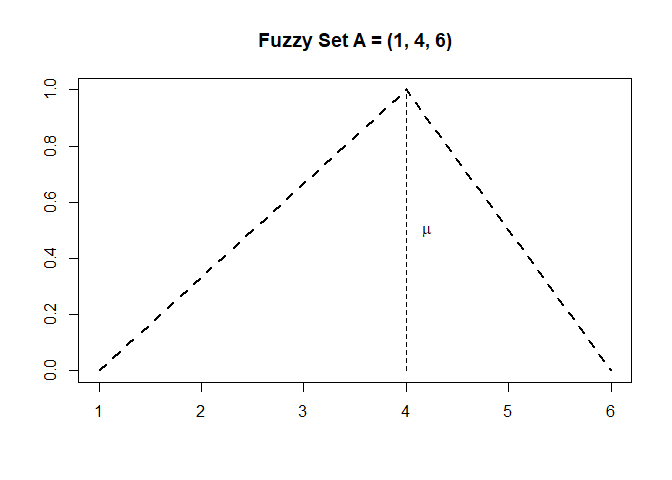
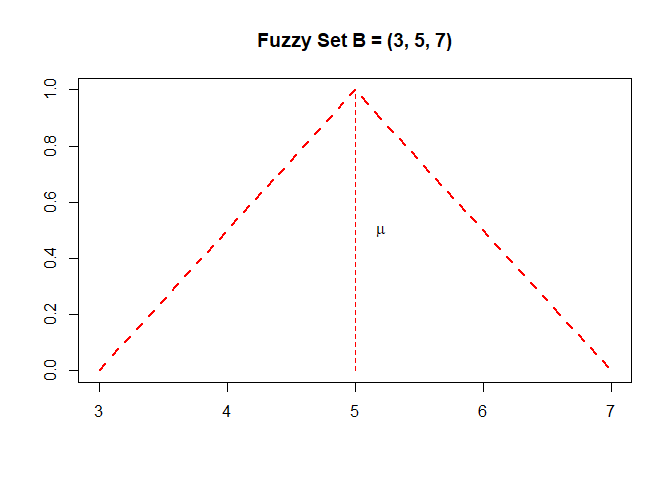
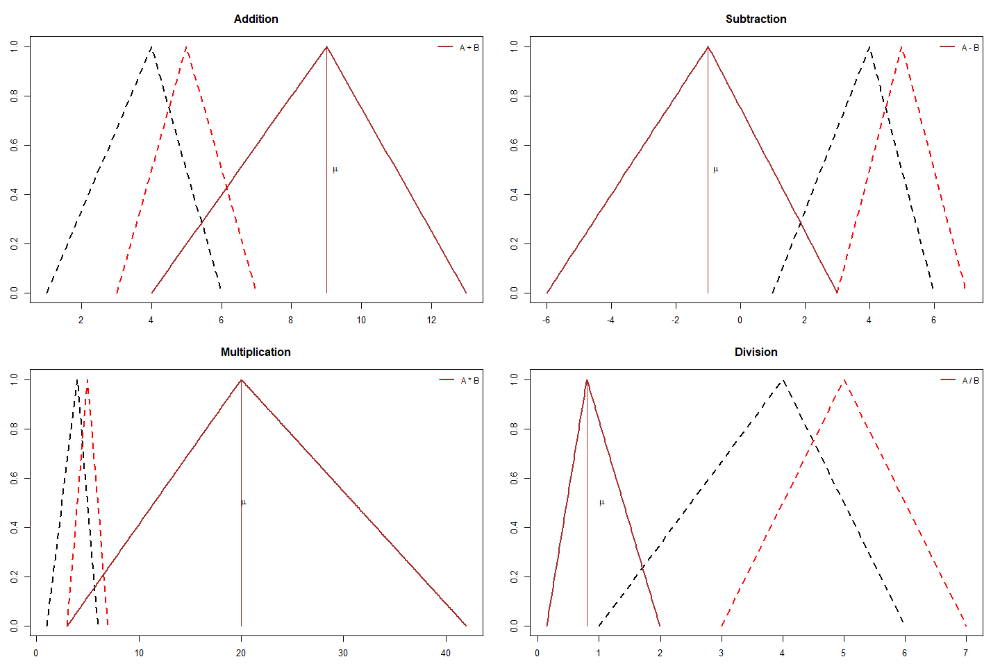
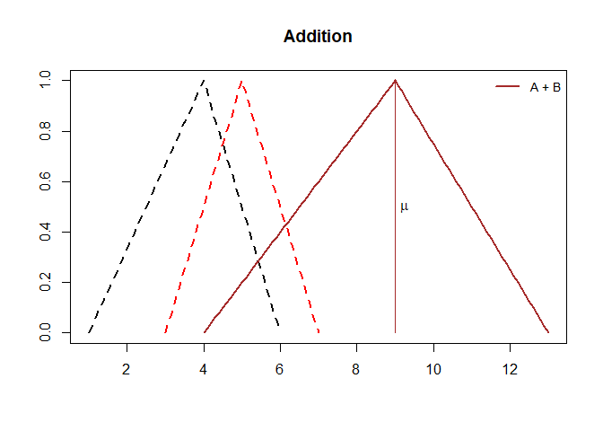
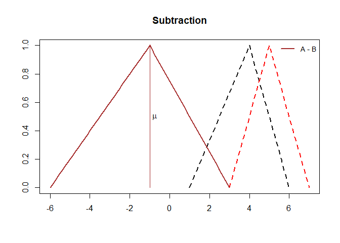
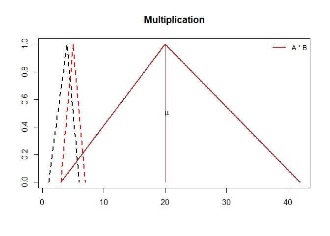
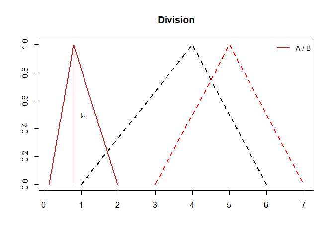

Fuzzy Arithmetics Operations
================

## Interval arithmetic

### Four fuzzy interval operations are implemented in the **fuzzy-arithmetic.R** script:

  - Addition
  - Subtraction
  - Multiplication
  - Division

<!-- end list -->

``` r
source("fuzzy-arithmetic.R")
```

### Let A = (\(min_A, mean_A, max_A\)) be a triangular fuzzy number represented by three points: minimum, mean and maximum values. From a base set \(X \in [min_A, max_A]\), the fuzzy set \(A:X \rightarrow [0, 1]\) is defined as \(A(x, min_A, mean_A, max_A)\)

``` r
fuzzy.number.a = c(min.value = 1, mean.value = 4, max.value = 6)
base.set.a = seq(fuzzy.number.a["min.value"], fuzzy.number.a["max.value"], by=0.1)
```

<!-- -->

``` r
fuzzy.number.b = c(min.value = 3, mean.value = 5, max.value = 7)
base.set.b = seq(fuzzy.number.b["min.value"], fuzzy.number.b["max.value"], by=0.1)
```

<!-- -->

### The **plot.ops** function gives the plot of all arithmetic operations

``` r
plot.ops(fuzzy.number.a, fuzzy.number.b)
```

<!-- -->

### Adding fuzzy number A and fuzzy number B

\(A = (min_A, mean_A, max_A) \\ B = (min_B, mean_B, max_B) \\ A+B = (min_A + min_B, mean_A + mean_B, max_A + max_B)\)

``` r
min.number = fuzzy.number.a['min.value'] + fuzzy.number.b['min.value']
mean.number = fuzzy.number.a['mean.value'] + fuzzy.number.b['mean.value']
max.number = fuzzy.number.a['max.value'] + fuzzy.number.b['max.value']
cat(paste0('A + B = [', min.number, ', ', max.number, '] = (', min.number, ', ', mean.number, ', ', max.number, ') '))
```

    ## A + B = [4, 13] = (4, 9, 13)

``` r
plot.ops(fuzzy.number.a, fuzzy.number.b, "add")
```

<!-- -->

### Subtracting fuzzy number A and fuzzy number B

\(A-B = (min_A - max_B, mean_A - mean_B, max_A - min_B)\)

``` r
min.number = fuzzy.number.a['min.value'] - fuzzy.number.b['max.value']
mean.number = fuzzy.number.a['mean.value'] - fuzzy.number.b['mean.value']
max.number = fuzzy.number.a['max.value'] - fuzzy.number.b['min.value']
cat(paste0('A - B = [', min.number, ', ', max.number, '] = (', min.number, ', ', mean.number, ', ', max.number, ')'))
```

    ## A - B = [-6, 3] = (-6, -1, 3)

``` r
plot.ops(fuzzy.number.a, fuzzy.number.b, "sub")
```

<!-- -->

### Multiplying fuzzy number A and fuzzy number B

\(A = (min_A, mean_A, max_A) \\ B = (min_B, mean_B, max_B) \\ (A * B) = \\ [\min\{min_A * min_B, min_A * max_B, max_A * min_B, max_A * max_B\}, \\ \max\{min_A * min_B, min_A * max_B, max_A * min_B, max_A * max_B\}]\)

``` r
mult.interval = function(x, y) c(x * y, rev(x) * y)
mult.ab = mult.interval(c(fuzzy.number.a["min.value"], fuzzy.number.a["max.value"]),
                  c(fuzzy.number.b["min.value"], fuzzy.number.b["max.value"]))
```

``` r
cat(paste0('A * B = [', min(mult.ab), ', ', max(mult.ab), ']'))
```

    ## A * B = [3, 42]

#### The **multiplication** of two fuzzy triangular numbers does **not result in a triangular number**

#### Because of that, we need to find the mean value of the resulting fuzzy triangular number by setting \(\alpha-cut = 1\)

#### Let \(A_\alpha[min^\alpha_A, max^\alpha_A]\) \(\forall \alpha [0, 1]\) be a crisp interval of a triangular fuzzy number

\(A_\alpha \\= [min^{\alpha}_A, max^{\alpha}_A] \\= [(mean_A - min_A)\alpha + min_A, -(max_A - mean_A)\alpha + max_A]\\\)

\(A = [1, 6] = (1, 4, 6)\\ A_\alpha \\ = [(4 - 1)\alpha + 1, -(6 - 4)\alpha + 6] \\ = [3\alpha + 1, -2\alpha + 6]\\\)

\(B = [3, 7] = (3, 5, 7) \\ B_\alpha \\ = [(5 - 3)\alpha + 3, -(7 - 5)\alpha + 7] \\ = [2\alpha + 3, -2\alpha + 7]\\\)

\[ (A * B)_\alpha = [(3\alpha +1)(2\alpha + 3), (-2\alpha + 6)(-2\alpha + 7)] \]

#### When \(\alpha = 0\):

``` r
alpha = 0
min.number = (3 * alpha + 1) * (2 * alpha + 3)
max.number = (-2 * alpha + 6) * (-2 * alpha + 7)
cat(paste0('(A * B)0 = [', min.number, ', ', max.number, ']'))
```

    ## (A * B)0 = [3, 42]

#### When \(\alpha = 1\):

``` r
alpha = 1
mean.number = (3 * alpha + 1) * (2 * alpha + 3)
cat(paste0('(A * B)1 = [', mean.number, ', ', (-2 * alpha + 6) * (-2 * alpha + 7), ']'))
```

    ## (A * B)1 = [20, 20]

#### Finally, the mean value of the resulting fuzzy triangular number by setting \(\alpha-cut = 1\) is A1 \* B1 = \[20, 20\] = 20

``` r
cat(paste0('A * B = [', min.number, ', ', max.number, '] = ', '(', min.number, ', ', mean.number, ', ', max.number, ')'))
```

    ## A * B = [3, 42] = (3, 20, 42)

``` r
plot.ops(fuzzy.number.a, fuzzy.number.b, "mult")
```

<!-- -->

### Dividing fuzzy number A and fuzzy number B

\(A = (min_A, mean_A, max_A) \\ B = (min_B, mean_B, max_B) \\ (A / B) \\ = \left[\min{\left(\frac{min_A}{min_B}, \frac{min_A}{max_B}, \frac{max_A}{min_B}, \frac{max_A}{max_B}\right)}, \max{\left(\frac{min_A}{min_B}, \frac{min_A}{max_B}, \frac{max_A}{min_B}, \frac{max_A}{max_B}\right)}\right]\)

``` r
div.interval = function(x, y) c(x / y, rev(x) / y)
div.ab = round(div.interval(c(fuzzy.number.a["min.value"], fuzzy.number.a["max.value"]),
                  c(fuzzy.number.b["min.value"], fuzzy.number.b["max.value"])), 2)
```

``` r
cat(paste0('A / B = [', min(div.ab), ', ', max(div.ab), ']'))
```

    ## A / B = [0.14, 2]

#### The **division** of two fuzzy triangular numbers does **not result in a triangular number**

#### Because of that, we need to find the mean value of the resulting fuzzy triangular number by setting \(\alpha-cut = 1\)

\[ (A / B)_\alpha = [(3\alpha +1)/(-2\alpha + 7), (-2\alpha + 6)/(2\alpha + 3)] \]

#### When \(\alpha = 0\):

``` r
alpha = 0
min.number = round((3 * alpha + 1)/(2 * alpha + 3), 2)
max.number = round((-2 * alpha + 6)/(-2 * alpha + 7), 2)
cat(paste0('(A / B)0 = [', min.number, ', ', max.number, ']'))
```

    ## (A / B)0 = [0.33, 0.86]

#### When \(\alpha = 1\):

``` r
alpha = 1
mean.number = round((3 * alpha + 1)/(2 * alpha + 3), 2)
cat(paste0('(A / B)1 = [', mean.number, ', ', round((-2 * alpha + 6)/(-2 * alpha + 7), 2), ']'))
```

    ## (A / B)1 = [0.8, 0.8]

#### Finally, the mean value of the resulting fuzzy triangular number by setting \(\alpha-cut = 1\) is (A / B)1 = \[0.8, 0.8\] = 0.8

``` r
cat(paste0('(A / B) = [', min.number, ', ', max.number, '] = (', min.number, ', ', mean.number, ', ', max.number, ')'))
```

    ## (A / B) = [0.33, 0.86] = (0.33, 0.8, 0.86)

``` r
plot.ops(fuzzy.number.a, fuzzy.number.b, "div")
```

<!-- -->
