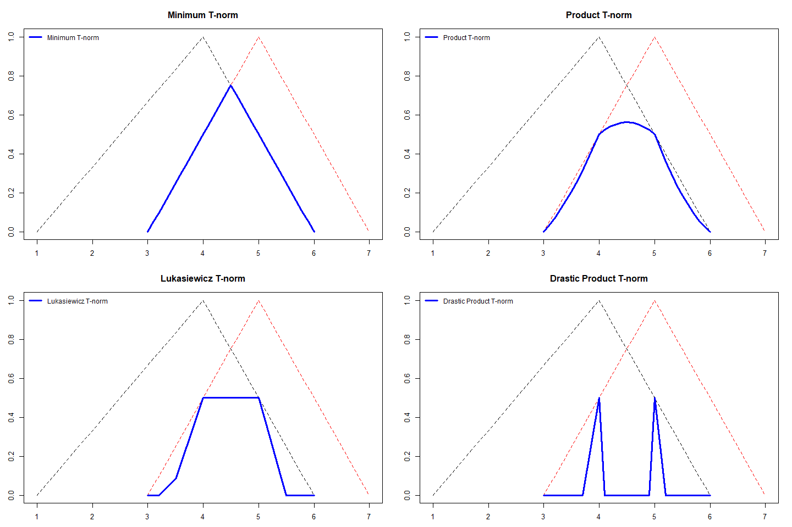
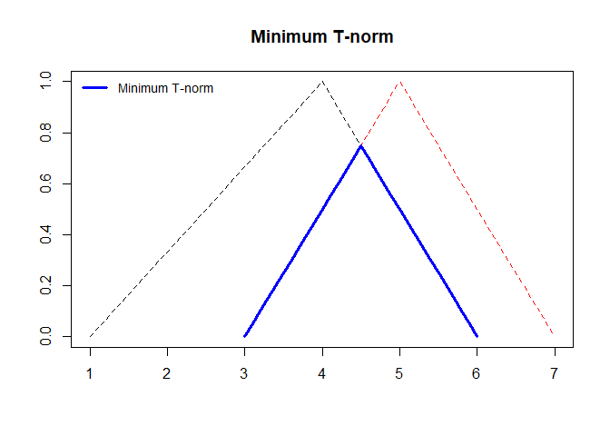
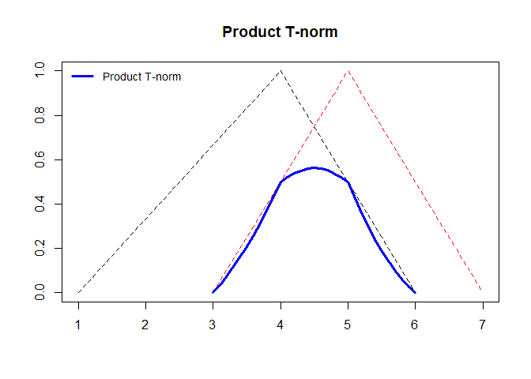
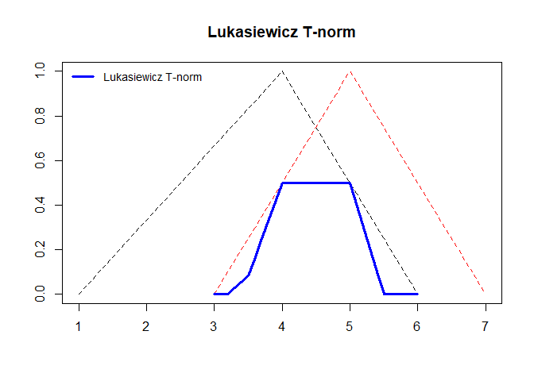
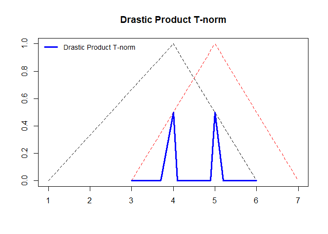
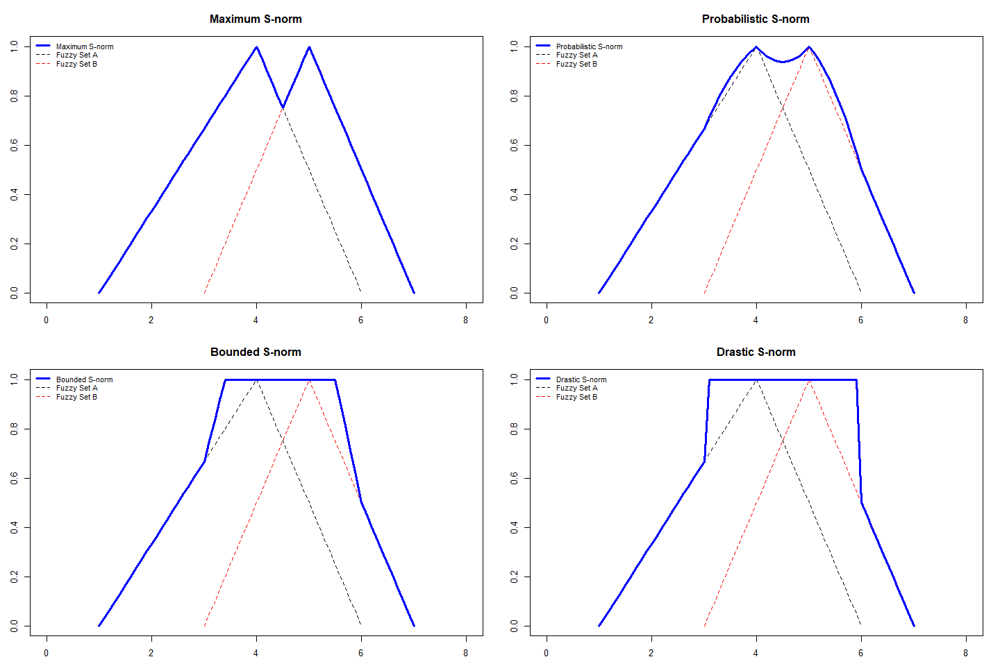
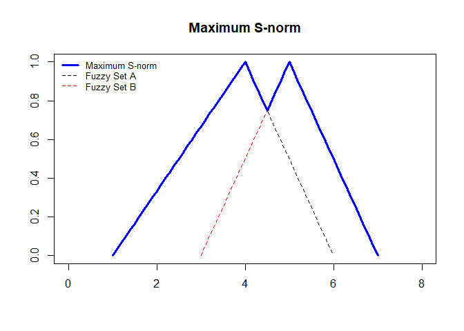
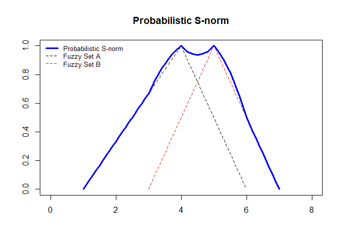
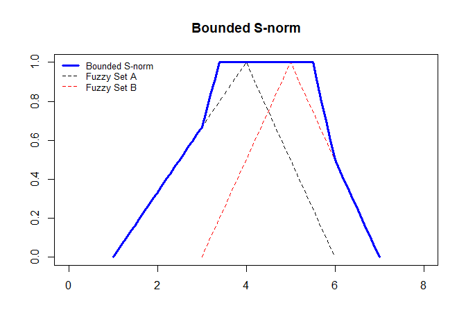
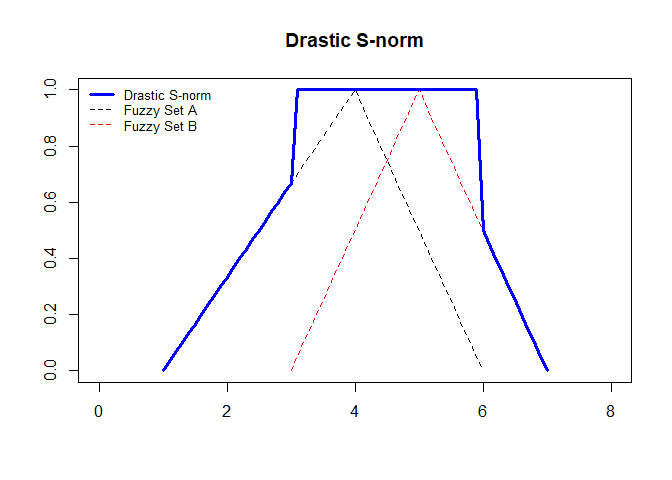

Fuzzy Operations
================

## Triangular Norms (T-norms)

### Four t-norms functions are implemented in the **t-norms.R** script:

  - Minimum
  - Product
  - Lukasiewicz
  - Drastic Product

<!-- end list -->

``` r
source("t-norms.R")
```

### A = (\(min_A, mean_A, max_A\)) and B = (\(min_B, mean_B, max_B\)) are triangular fuzzy numbers represented by three points: minimum, mean and maximum values

``` r
fuzzy.number.a = c(min.value = 1, mean.value = 4, max.value = 6)
fuzzy.number.b = c(min.value = 3, mean.value = 5, max.value = 7)
```

### The *plot.tnorms* function gives the plot of all T-norms

``` r
plot.tnorms(fuzzy.number.a, fuzzy.number.b)
```

<!-- -->

### Minimum T-norm

``` r
plot.tnorms(fuzzy.number.a, fuzzy.number.b, "min")
```

<!-- -->

### Product T-norm

``` r
plot.tnorms(fuzzy.number.a, fuzzy.number.b, "pro")
```

<!-- -->

### Lukasiewicz T-norm

``` r
plot.tnorms(fuzzy.number.a, fuzzy.number.b, "luka")
```

<!-- -->

### Drastic Product T-norm

``` r
plot.tnorms(fuzzy.number.a, fuzzy.number.b, "dra")
```

<!-- -->

## Triangular Conorms (S-norms)

### Four t-norms functions are implemented in the **s-norms.R** script:

  - Maximum
  - Probabilistic sum
  - Bounded sum (Lukasiewicz)
  - Drastic sum

<!-- end list -->

``` r
source("s-norms.R")
```

### The *plot.snorms* function gives the plot of all S-norms

``` r
plot.snorms(fuzzy.number.a, fuzzy.number.b)
```

<!-- -->

### Maximum S-norm

``` r
plot.snorms(fuzzy.number.a, fuzzy.number.b, "max")
```

<!-- -->

### Probabilistic sum S-norm

``` r
plot.snorms(fuzzy.number.a, fuzzy.number.b, "pro")
```

<!-- -->

### Bounded sum (Lukasiewicz) S-norm

``` r
plot.snorms(fuzzy.number.a, fuzzy.number.b, "bound")
```

<!-- -->

### Drastic sum S-norm

``` r
plot.snorms(fuzzy.number.a, fuzzy.number.b, "dra")
```

<!-- -->
